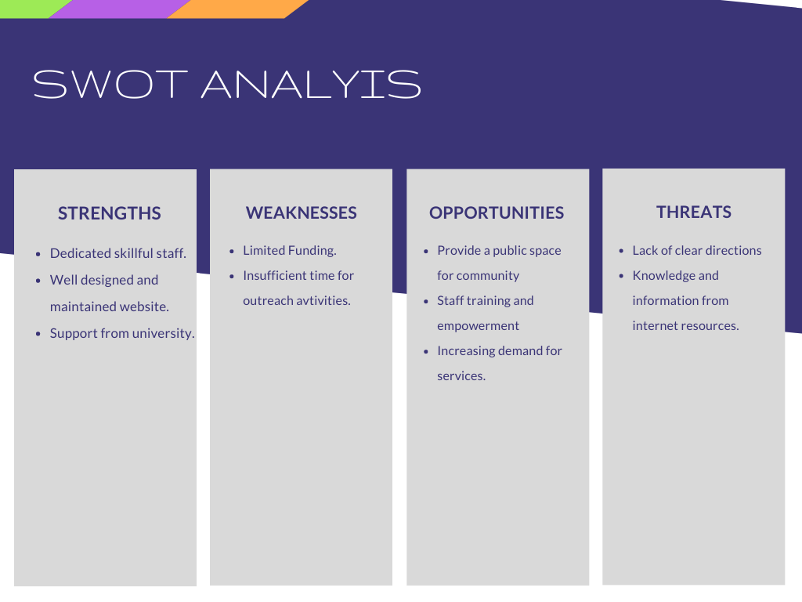

# Requirements
### Introduction

- Library automation system is a part of the complete university / college management system and is also available individually. It offers a simple yet powerful solution to automate all kinds of libraries. 
- The software helps you manage print materials like books, journals and magazines along with the non print materials like ebooks, cd, dvd, e-journals, etc.
-  It helps to maintain acquisition register, stock register, reports etc. This module can be integrated with bar codes, Rf-id's & smart cards. You can pringt barcoded book labels as well as library cards.

### Research

- The history of libraries began with the first efforts to organize collections of documents. The first libraries consisted of archives of the earliest form of writing—the clay tablets in cuneiform script discovered in Sumer, some dating back to 2600 BC. 
- Private or personal libraries made up of written books appeared in classical Greece in the 5th century BC.
- The Fatimids (r. 909-1171) also possessed many great libraries within their domains. The historian Ibn Abi Tayyi’ describes their palace library, which probably contained the largest collection of literature on earth at the time, as a “wonder of the world”. 

### Cost

Library automation software has been created for educational institutions to help them campus management, academic administrative tasks effectively. comparing with the cost it would start around Rs.20,000 and increases based on the customer requirements.
### Time
he essence of time management involves increasing efficiency and effectiveness in a limited time period.
### Features
- Can create a computerized management system for a library
- Has the capability to issue books 
-  Has the capability to return books 
-   Has an administrator account 
-  Tracks the books that users have issued
-   Keeps the databases correct and up-to-date 

### Defining the System

### SWOT Analysis

### 4W's and 1'H
#### who: 
Library management systems help libraries keep track of the books and their checkouts, as well as members' subscriptions and profiles.
#### What:
A library management system is  software that is designed & developed to manage all the in-house functions of a library.
#### When:
college and university overseeing all library operations, managing library budget , planning and negotiating the acquisition of materials, stacks maintenance, over seeing fee collection, event planning, fundraising, and human resources

#### Where:
College and university libraries are making headway, despite the rising challenges and expectations of today’s students. The online based library management system provides easy ways for librarians to create and store their library collections. It enables students and staff to communicate and collaborate through multiple channels.

#### How:
Library management system is a software that uses to maintain the record of the library. It contains work like the number of available books in the library, the number of books are issued or returning or renewing a book or late fine charge record, etc. Library Management Systems is software that helps to maintain a database that is useful to enter new books & record books borrowed by the students with the respective submission dates.
